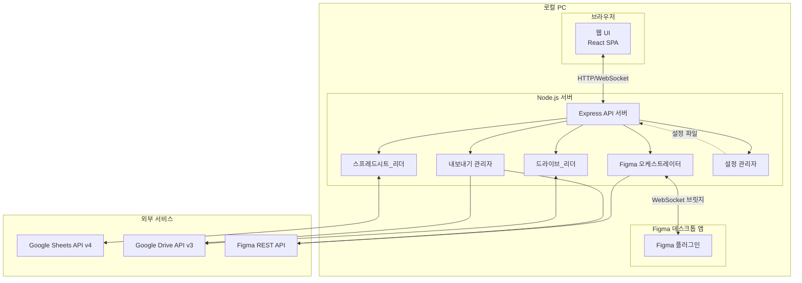
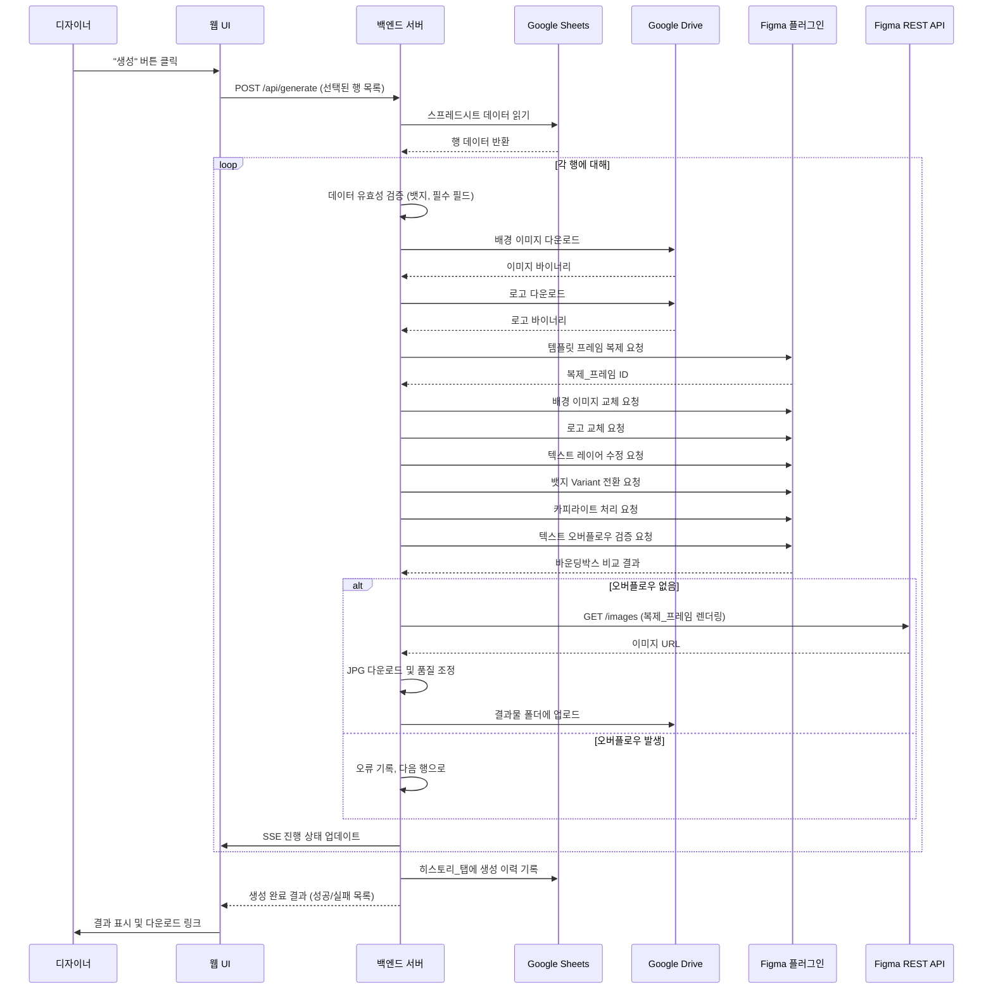
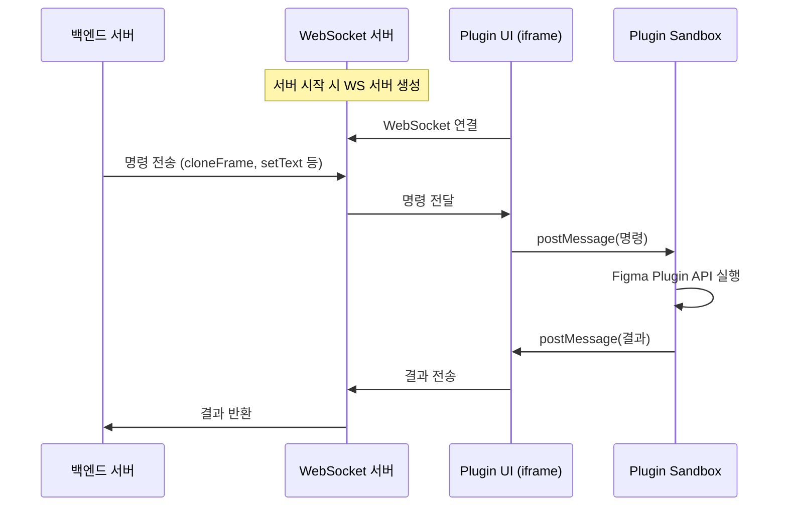
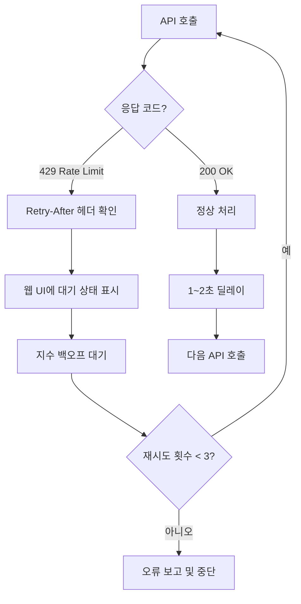

# 설계 문서: Figma 카드뉴스 자동화

## 개요

Figma 카드뉴스 자동화 시스템은 구글 스프레드시트의 데이터를 읽어 Figma 템플릿에 자동으로 적용하고, 808×454px JPG 이미지를 생성하는 로컬 실행 웹 애플리케이션이다.

시스템은 크게 세 계층으로 구성된다:
- **웹 UI (프론트엔드)**: React 기반 SPA로, 디자이너가 브라우저에서 카드뉴스 생성을 제어
- **백엔드 서버**: Node.js/Express 기반 로컬 서버로, Google API 연동 및 비즈니스 로직 처리
- **Figma 플러그인**: Figma 데스크톱 앱 내에서 실행되며, 프레임 복제·레이어 수정·바운딩박스 검증 수행

### 핵심 설계 결정

| 결정 사항 | 선택 | 근거 |
|-----------|------|------|
| Figma 연동 방식 | Plugin API(수정) + REST API(읽기/내보내기) 하이브리드 | REST API는 노드 수정 불가. Plugin API만 텍스트·이미지·컴포넌트 변경 가능 |
| 프레임 생성 방식 | 템플릿 복제(clone) | 원본 템플릿 보존, 각 카드뉴스 독립 프레임으로 관리 |
| 품질 자동 조정 | 80% → 점진적 하향(최소 70%) | 500KB 권장 기준 충족을 위한 자동 최적화 |
| 텍스트 검증 | 사후 검증(absoluteBoundingBox 비교) | Figma에 텍스트 입력 후 실제 렌더링 결과 기반 검증 |
| 인증 방식 | Google Service Account | 비개발자 대상, OAuth 동의 화면 불필요 |
| 데이터 동기화 | 웹 UI → 구글 시트 단방향 | 충돌 방지, 단순한 데이터 흐름 |
| 히스토리 저장 | 구글 시트 별도 탭 | 추가 DB 불필요, 디자이너가 직접 확인 가능 |

## 아키텍처

### 시스템 아키텍처 다이어그램



### 데이터 흐름 다이어그램



### Plugin-Server 통신 브릿지

Figma Plugin은 Figma 데스크톱 앱의 샌드박스 내에서 실행되므로, 백엔드 서버와 직접 통신할 수 없다. 이를 해결하기 위해 WebSocket 기반 통신 브릿지를 사용한다.



- Plugin UI(iframe)는 브라우저 API에 접근 가능하므로 WebSocket 연결 가능
- Plugin Sandbox는 `figma.*` API에 접근 가능하지만 네트워크 불가
- 두 레이어 간 `postMessage`로 통신

## 컴포넌트 및 인터페이스

### 1. 웹 UI (프론트엔드)

**기술 스택**: React + TypeScript + Vite

| 컴포넌트 | 역할 |
|----------|------|
| `SetupWizard` | 초기 설정 마법사 (API 키 입력, Figma 파일/템플릿 선택, 레이어 검증, 연결 테스트) |
| `SpreadsheetTable` | 스프레드시트 데이터 테이블 (인라인 편집, 체크박스 선택) |
| `BadgeAutocomplete` | 뱃지 자동완성/드롭다운 (20종 목록, 실시간 유효성 검증) |
| `PreviewPanel` | 카드뉴스 미리보기 (0.5x 저해상도) |
| `GenerationProgress` | 생성 진행 상태 표시 (SSE 기반 실시간 업데이트) |
| `ResultSummary` | 생성 결과 요약 (성공/실패 수, 오류 목록, 다운로드 링크) |
| `HistoryList` | 히스토리 목록 및 상세 보기 |
| `FrameCleanup` | 복제 프레임 정리 UI |

### 2. 백엔드 서버

**기술 스택**: Node.js + Express + TypeScript

#### API 엔드포인트

```typescript
// 설정 관련
POST   /api/config/setup          // 초기 설정 저장
POST   /api/config/test-connection // 연결 테스트
GET    /api/config/status          // 설정 상태 확인

// Figma 템플릿 관련
GET    /api/figma/frames           // Figma 파일의 최상위 프레임 목록 조회
POST   /api/figma/validate-template // 선택된 프레임의 레이어 이름 규칙 검증

// 스프레드시트 관련
GET    /api/sheets/data            // 스프레드시트 데이터 읽기
PUT    /api/sheets/cell            // 셀 데이터 수정 (웹 UI → 구글 시트)
POST   /api/sheets/refresh         // 최신 데이터 새로고침

// 카드뉴스 생성
POST   /api/generate               // 카드뉴스 생성 시작 (선택된 행 목록)
GET    /api/generate/progress      // SSE 진행 상태 스트림
POST   /api/preview/:rowIndex      // 특정 행 미리보기

// 히스토리
GET    /api/history                 // 히스토리 목록
GET    /api/history/:id            // 히스토리 상세

// 프레임 관리
GET    /api/frames/batches         // 정리 가능한 배치 목록
DELETE /api/frames/:batchId        // 배치 프레임 삭제

// 다운로드
GET    /api/download/:fileId       // 구글 드라이브 파일 다운로드
```

### 3. 스프레드시트_리더 모듈

```typescript
interface SpreadsheetReader {
  // 전체 행 데이터 읽기
  readAllRows(): Promise<CardNewsRow[]>;

  // 특정 셀 업데이트 (웹 UI → 구글 시트)
  updateCell(row: number, col: number, value: string): Promise<void>;

  // 히스토리 탭에 기록 추가
  appendHistory(record: HistoryRecord): Promise<void>;

  // 히스토리 탭 데이터 읽기
  readHistory(): Promise<HistoryRecord[]>;
}
```

### 4. 드라이브_리더 모듈

```typescript
interface DriveReader {
  // 배경 이미지 다운로드
  downloadBackground(filename: string): Promise<Buffer>;

  // 로고 다운로드
  downloadLogo(filename: string): Promise<Buffer>;

  // 결과물 업로드
  uploadResult(filename: string, data: Buffer): Promise<string>; // fileId 반환

  // 파일 존재 여부 확인
  fileExists(folderId: string, filename: string): Promise<boolean>;

  // 결과물 폴더 내 파일 목록
  listResultFiles(): Promise<DriveFile[]>;
}
```

### 5. Figma 오케스트레이터

```typescript
interface FigmaOrchestrator {
  // 배치 시작 시 템플릿 스펙 캐싱 (REST API)
  cacheTemplateSpec(fileKey: string, templateNodeId: string): Promise<TemplateSpec>;

  // Plugin에 명령 전송 (WebSocket 브릿지 경유)
  cloneFrame(templateNodeId: string): Promise<string>; // 복제_프레임 ID
  setTextLayer(frameId: string, layerName: string, text: string): Promise<void>;
  hideLayer(frameId: string, layerName: string): Promise<void>;
  replaceImage(frameId: string, layerName: string, imageData: Buffer): Promise<void>;
  switchBadgeVariant(frameId: string, badgeCount: number, badges: BadgeInfo[]): Promise<void>;
  checkOverflow(frameId: string, layerName: string): Promise<OverflowResult>;
  deleteFrames(frameIds: string[]): Promise<void>;

  // REST API 직접 호출
  exportImage(fileKey: string, nodeId: string, scale: number, format: string): Promise<Buffer>;
}
```

### 6. 내보내기 관리자

```typescript
interface ExportManager {
  // 이미지 내보내기 (품질 자동 조정 포함)
  exportWithQualityAdjustment(
    fileKey: string,
    nodeId: string,
    movieTitle: string
  ): Promise<ExportResult>;

  // 파일명 생성 (중복 시 순번 추가)
  generateFilename(movieTitle: string, existingFiles: string[]): string;
}
```

### 7. Figma 플러그인

```typescript
// Plugin Sandbox 측 메시지 핸들러
interface PluginCommandHandler {
  'clone-frame': (params: { templateNodeId: string }) => { frameId: string };
  'set-text': (params: { frameId: string; layerName: string; text: string }) => void;
  'hide-layer': (params: { frameId: string; layerName: string }) => void;
  'replace-image': (params: { frameId: string; layerName: string; imageBase64: string }) => void;
  'switch-badge-variant': (params: { frameId: string; count: number; badges: BadgeInfo[] }) => void;
  'check-overflow': (params: { frameId: string; layerName: string }) => OverflowResult;
  'delete-frames': (params: { frameIds: string[] }) => void;
}
```

## 데이터 모델

### CardNewsRow (스프레드시트 행 데이터)

```typescript
interface CardNewsRow {
  rowIndex: number;           // 스프레드시트 행 번호 (1-based)
  movieTitle: string;         // 영화/드라마 제목
  backgroundFilename: string; // 배경 이미지 파일명
  logoFilename: string;       // 로고 파일명
  mainText: string;           // 기본문구 (줄바꿈 포함 가능, 최대 3줄)
  subText: string;            // 추가문구 (빈 값 가능)
  badge1: string;             // 뱃지 1 (빈 값 가능)
  badge2: string;             // 뱃지 2 (빈 값 가능)
  badge3: string;             // 뱃지 3 (빈 값 가능)
  badge4: string;             // 뱃지 4 (빈 값 가능)
  copyright: string;          // 카피라이트 (빈 값 가능)
}
```

### BadgeInfo (뱃지 정보)

```typescript
// 20종 뱃지 정규화 매핑
const VALID_BADGES = [
  '무료', 'UHD', 'AI 보이스', '사전예약', '할인',
  '프리미엄무료', '가격인하', '소장', 'HD', '우리말',
  '예고편', '가치봄-자막+수어', 'Dolby ATMOS', 'Dolby VISION',
  'Dolby VISION-ATMOS', '이벤트', 'U+독점', 'U+오리지널',
  'U+STAGE', '유플레이'
] as const;

type ValidBadgeName = typeof VALID_BADGES[number];

interface BadgeInfo {
  name: ValidBadgeName;
  position: number; // 1~4
}

// 정규화 함수: 대소문자 무시, 앞뒤 공백 제거
function normalizeBadgeName(input: string): ValidBadgeName | null;
```

### TemplateSpec (템플릿 스펙 캐시)

```typescript
interface TemplateSpec {
  templateNodeId: string;
  layers: {
    background: LayerSpec;
    logo: LayerSpec;
    mainText: LayerSpec;
    subText: LayerSpec;
    copyright: LayerSpec;
    badgeContainer: LayerSpec;
  };
  cachedAt: number; // timestamp
}

interface LayerSpec {
  nodeId: string;
  name: string;
  x: number;
  y: number;
  width: number;
  height: number;
  type: string;
}
```

### OverflowResult (오버플로우 검증 결과)

```typescript
interface OverflowResult {
  isOverflowing: boolean;
  textBounds: BoundingBox;
  parentBounds: BoundingBox;
  overflowX: number; // 초과 픽셀 (0이면 정상)
  overflowY: number;
}

interface BoundingBox {
  x: number;
  y: number;
  width: number;
  height: number;
}
```

### ExportResult (내보내기 결과)

```typescript
interface ExportResult {
  success: boolean;
  filename: string;
  fileId: string;          // 구글 드라이브 파일 ID
  quality: number;         // 최종 적용된 품질 (70~80)
  fileSize: number;        // 바이트
  sizeWarning: boolean;    // 70%에서도 500KB 초과 시 true
  downloadUrl: string;
}
```

### HistoryRecord (히스토리 기록)

```typescript
interface HistoryRecord {
  id: string;              // UUID
  createdAt: string;       // ISO 8601
  totalCount: number;      // 생성 시도 수
  successCount: number;    // 성공 수
  errorCount: number;      // 오류 수
  files: HistoryFile[];    // 생성된 파일 목록
  errors: HistoryError[];  // 오류 목록
}

interface HistoryFile {
  filename: string;
  driveFileId: string;
  movieTitle: string;
  rowIndex: number;
}

interface HistoryError {
  rowIndex: number;
  movieTitle: string;
  errorType: 'BADGE_INVALID' | 'FILE_NOT_FOUND' | 'TEXT_OVERFLOW' |
             'LINE_LIMIT' | 'API_ERROR' | 'RENDER_ERROR';
  message: string;
}
```

### GenerationProgress (생성 진행 상태)

```typescript
interface GenerationProgress {
  status: 'idle' | 'running' | 'completed' | 'error';
  currentRow: number;
  totalRows: number;
  currentStep: string;     // '데이터 검증', '이미지 로드', 'Figma 수정', '렌더링', '업로드'
  results: RowResult[];
  rateLimit?: {
    waiting: boolean;
    retryAfter: number;    // 초
  };
}

interface RowResult {
  rowIndex: number;
  movieTitle: string;
  status: 'success' | 'error' | 'warning';
  error?: string;
  sizeWarning?: boolean;
}
```

### AppConfig (애플리케이션 설정)

```typescript
interface AppConfig {
  google: {
    serviceAccountKey: object;  // JSON 키 파일 내용
    spreadsheetId: string;
    driveFolderId: string;
  };
  figma: {
    accessToken: string;
    fileKey: string;            // Figma 파일 URL에서 추출
    templateNodeId: string;     // 설정 마법사에서 드롭다운 선택
  };
  template: {
    layerNames: TemplateLayerNames;  // 레이어 이름 규칙 (기본값 제공)
  };
  server: {
    port: number;              // 기본값: 3000
  };
}

// Figma 템플릿 레이어 이름 규칙
interface TemplateLayerNames {
  background: string;      // 기본값: 'bg_image'
  logo: string;            // 기본값: 'logo'
  mainText: string;        // 기본값: 'main_text'
  subText: string;         // 기본값: 'sub_text'
  copyright: string;       // 기본값: 'copyright'
  badgeContainer: string;  // 기본값: 'badge_container'
}

const DEFAULT_LAYER_NAMES: TemplateLayerNames = {
  background: 'bg_image',
  logo: 'logo',
  mainText: 'main_text',
  subText: 'sub_text',
  copyright: 'copyright',
  badgeContainer: 'badge_container',
};
```


## 정확성 속성 (Correctness Properties)

*속성(Property)이란 시스템의 모든 유효한 실행에서 참이어야 하는 특성 또는 동작을 의미한다. 속성은 사람이 읽을 수 있는 명세와 기계가 검증할 수 있는 정확성 보장 사이의 다리 역할을 한다.*

### Property 1: 스프레드시트 행 데이터 라운드트립

*For any* 유효한 스프레드시트 행 데이터(영화제목, 배경파일명, 로고파일명, 기본문구, 추가문구, 뱃지1~4, 카피라이트 — 빈 값 및 줄바꿈 포함)에 대해, 해당 데이터를 `CardNewsRow`로 파싱한 후 다시 동일 형식의 셀 배열로 직렬화하면 원본 데이터와 동일한 결과를 생성해야 한다.

**Validates: Requirements 1.2, 1.3, 1.4, 1.5**

### Property 2: 선택적 필드 가시성 결정

*For any* `CardNewsRow` 데이터에 대해, 추가문구(`subText`)가 빈 문자열이면 해당 레이어에 대해 숨김(hide) 명령이 발행되어야 하고, 비어있지 않으면 텍스트 설정(setText) 명령이 발행되어야 한다. 카피라이트(`copyright`) 필드에도 동일한 규칙이 적용되어야 한다.

**Validates: Requirements 3.7, 3.9**

### Property 3: 뱃지 유효성 검증 및 정규화

*For any* 입력 문자열에 대해, 뱃지 정규화 함수(`normalizeBadgeName`)는 다음을 만족해야 한다:
- 유효한 뱃지 이름의 대소문자 변형 및 앞뒤 공백 추가 버전이 입력되면, 정규화된 정식 뱃지 이름을 반환한다.
- 20종 뱃지 목록에 포함되지 않는 문자열이 입력되면, `null`을 반환한다.
- 유효한 뱃지가 1~4개 주어지면 해당 개수의 뱃지 Variant가 선택되고, 0개이면 뱃지 레이어가 숨김 처리된다.

**Validates: Requirements 4.2, 4.4, 4.5, 4.6**

### Property 4: JPG 품질 자동 조정 알고리즘

*For any* 이미지 내보내기 시도에 대해, 품질 조정 알고리즘은 다음을 만족해야 한다:
- 80% 품질에서 500KB 이하이면, 80% 품질로 저장한다.
- 80% 품질에서 500KB 초과이면, 품질을 점진적으로 낮추어 500KB 이하가 되는 최고 품질(70~79%)로 저장한다.
- 70% 품질에서도 500KB 초과이면, 70% 품질로 저장하고 `sizeWarning: true`를 반환한다.
- 최종 품질은 항상 70 이상 80 이하이다.

**Validates: Requirements 5.3, 5.4, 5.5**

### Property 5: 파일명 생성 및 중복 처리

*For any* 영화 제목과 기존 파일명 목록에 대해, `generateFilename` 함수는 다음을 만족해야 한다:
- 반환된 파일명은 `카드뉴스_(영화제목).jpg` 또는 `카드뉴스_(영화제목)_NN.jpg` 형식이다.
- 반환된 파일명은 기존 파일명 목록에 존재하지 않는다 (유일성).
- 동일 제목의 첫 번째 파일은 순번 없이, 두 번째부터 `_02`, `_03` 순번이 추가된다.

**Validates: Requirements 5.6, 5.7**

### Property 6: 텍스트 오버플로우 감지

*For any* 텍스트 바운딩박스와 부모 프레임 바운딩박스 쌍에 대해, 오버플로우 감지 함수는 다음을 만족해야 한다:
- 텍스트 바운딩박스가 부모 프레임 영역 내에 완전히 포함되면 `isOverflowing: false`를 반환한다.
- 텍스트 바운딩박스가 부모 프레임 영역을 x축 또는 y축으로 초과하면 `isOverflowing: true`를 반환하고, 초과 픽셀 값이 양수이다.

**Validates: Requirements 6.1**

### Property 7: 기본문구 줄 수 제한 검증

*For any* 문자열에 대해, 줄 수 검증 함수는 줄바꿈 문자(`\n`)를 기준으로 줄 수를 계산하여, 3줄 이하이면 유효, 4줄 이상이면 무효로 판정해야 한다.

**Validates: Requirements 6.4**

### Property 8: 배치 오류 격리

*For any* 카드뉴스 행 배치에서, 일부 행에 오류가 있더라도(뱃지 오류, 파일 미존재, 텍스트 오버플로우 등), 오류가 없는 나머지 행은 정상적으로 처리되어야 한다. 즉, 오류 행의 존재가 정상 행의 처리 결과에 영향을 미치지 않아야 한다.

**Validates: Requirements 12.1**

### Property 9: URL에서 ID 추출

*For any* 유효한 구글 스프레드시트 URL(`https://docs.google.com/spreadsheets/d/{ID}/...` 형식)에 대해, ID 추출 함수는 올바른 스프레드시트 ID를 반환해야 한다. 마찬가지로, *for any* 유효한 구글 드라이브 폴더 URL(`https://drive.google.com/drive/folders/{ID}...` 형식)에 대해, 올바른 폴더 ID를 반환해야 한다. 또한, *for any* 유효한 Figma 파일 URL(`https://www.figma.com/file/{fileKey}/...` 또는 `https://www.figma.com/design/{fileKey}/...` 형식)에 대해, 올바른 File Key를 반환해야 한다.

**Validates: Requirements 14.7, 14.8, 14.10**

### Property 10: 설정 파일 라운드트립

*For any* 유효한 `AppConfig` 객체에 대해, 설정 파일로 저장한 후 다시 로드하면 원본 객체와 동일한 결과를 생성해야 한다.

**Validates: Requirements 14.12**

### Property 11: 설정 유효성 검증

*For any* `AppConfig` 객체에 대해, 필수 필드(serviceAccountKey, spreadsheetId, driveFolderId, accessToken, fileKey, templateNodeId)가 모두 존재하고 비어있지 않으면 유효로 판정하고, 하나라도 누락되거나 비어있으면 무효로 판정해야 한다.

**Validates: Requirements 14.19**

### Property 12: 템플릿 레이어 이름 검증

*For any* Figma 프레임의 레이어 이름 목록과 필수 레이어 이름 규칙(`bg_image`, `logo`, `main_text`, `sub_text`, `copyright`, `badge_container`)에 대해, 검증 함수는 다음을 만족해야 한다:
- 모든 필수 레이어 이름이 프레임 내에 존재하면 유효로 판정한다.
- 하나라도 누락되면 무효로 판정하고, 누락된 레이어 이름 목록을 반환한다.

**Validates: Requirements 14.13, 14.14**

## 에러 처리

### 에러 분류 및 대응 전략

| 에러 유형 | 원인 | 대응 | 사용자 안내 |
|-----------|------|------|------------|
| `BADGE_INVALID` | 20종에 없는 뱃지 이름 | 해당 행 건너뛰기 | "N행: 뱃지 'xxx'는 유효하지 않습니다" |
| `FILE_NOT_FOUND` | 구글 드라이브에 파일 없음 | 해당 행 건너뛰기 | "N행: 파일 'xxx'를 찾을 수 없습니다" |
| `TEXT_OVERFLOW` | 텍스트가 레이어 영역 초과 | 해당 행 건너뛰기 | "N행: 기본문구가 영역을 초과합니다. 텍스트를 줄여주세요" |
| `LINE_LIMIT` | 기본문구 3줄 초과 | 해당 행 건너뛰기 | "N행: 기본문구는 최대 3줄까지 가능합니다" |
| `API_ERROR` | Figma/Google API 호출 실패 | 재시도 옵션 제공 | "API 오류가 발생했습니다. 재시도하시겠습니까?" |
| `RENDER_ERROR` | Figma 렌더링 실패 | 해당 행 건너뛰기 | "N행: 이미지 렌더링에 실패했습니다" |
| `RATE_LIMIT` | Figma API 요청 제한 | 자동 backoff 후 재시도 | "API 대기 중... (N초 후 재시도)" |
| `CONNECTION_ERROR` | 네트워크/인증 실패 | 전체 중단, 설정 확인 안내 | "연결에 실패했습니다. 설정을 확인해주세요" |
| `SIZE_WARNING` | 70% 품질에서도 500KB 초과 | 경고만 표시, 생성 완료 | "N행: 파일 용량이 500KB를 초과합니다 (권장 기준)" |

### Rate Limit 대응 전략



- 요청 간 기본 딜레이: 1~2초
- Rate Limit 발생 시: 지수 백오프 (2초, 4초, 8초)
- 최대 재시도: 3회
- 배치 시작 시 템플릿 스펙 1회 캐싱으로 불필요한 API 호출 최소화

### 행 단위 오류 격리

```typescript
// 의사 코드: 배치 처리 루프
for (const row of selectedRows) {
  try {
    await processRow(row);
    results.push({ rowIndex: row.rowIndex, status: 'success' });
  } catch (error) {
    if (error instanceof RateLimitError) {
      await backoffAndRetry(error);  // Rate Limit은 전체에 영향
      continue;
    }
    results.push({
      rowIndex: row.rowIndex,
      status: 'error',
      error: classifyError(error)
    });
    // 다음 행 계속 처리
  }
}
```

## 테스트 전략

### 이중 테스트 접근법

이 프로젝트는 **단위 테스트**와 **속성 기반 테스트(Property-Based Testing)**를 병행한다.

### 속성 기반 테스트 (PBT)

**라이브러리**: [fast-check](https://github.com/dubzzz/fast-check) (TypeScript/JavaScript용 PBT 라이브러리)

각 속성 테스트는 최소 100회 반복 실행하며, 설계 문서의 속성 번호를 태그로 참조한다.

| 속성 | 테스트 대상 함수 | 생성기 전략 |
|------|-----------------|------------|
| Property 1 | `parseRow()` / `serializeRow()` | 임의의 문자열 배열 (빈 값, 줄바꿈 포함) |
| Property 2 | `determineLayerAction()` | 임의의 CardNewsRow (빈/비빈 subText, copyright) |
| Property 3 | `normalizeBadgeName()` / `determineBadgeVariant()` | 유효 뱃지의 대소문자·공백 변형 + 무효 문자열 |
| Property 4 | `adjustQuality()` | 임의의 파일 크기 시퀀스 (모킹) |
| Property 5 | `generateFilename()` | 임의의 영화 제목 + 기존 파일명 목록 |
| Property 6 | `detectOverflow()` | 임의의 BoundingBox 쌍 |
| Property 7 | `validateLineCount()` | 임의의 문자열 (줄바꿈 0~10개) |
| Property 8 | `processBatch()` | 임의의 행 배치 (일부 오류 행 포함, 모킹) |
| Property 9 | `extractSpreadsheetId()` / `extractFolderId()` | 유효한 Google URL 패턴 생성 |
| Property 10 | `saveConfig()` / `loadConfig()` | 임의의 AppConfig 객체 |
| Property 11 | `validateConfig()` | 임의의 AppConfig (일부 필드 누락 변형) |

태그 형식: `Feature: figma-card-news-automation, Property N: {속성 설명}`

### 단위 테스트 (Example-Based)

| 테스트 대상 | 테스트 내용 |
|------------|------------|
| 스프레드시트 연동 | Google Sheets API 모킹, 데이터 읽기/쓰기 |
| 드라이브 연동 | Google Drive API 모킹, 파일 다운로드/업로드 |
| Figma 캐싱 | 배치 내 템플릿 스펙 1회만 조회 확인 |
| Rate Limit 처리 | 429 응답 시 백오프 동작 확인 |
| 오류 메시지 | 각 에러 유형별 올바른 메시지 생성 |
| 설정 마법사 | 연결 테스트 성공/실패 시나리오 |
| 미리보기 | 0.5x 스케일 파라미터 전달 확인 |

### 통합 테스트

| 테스트 대상 | 테스트 내용 |
|------------|------------|
| 전체 생성 파이프라인 | 모킹된 외부 서비스로 end-to-end 흐름 검증 |
| WebSocket 브릿지 | 서버 ↔ Plugin 통신 메시지 전달 검증 |
| SSE 진행 상태 | 실시간 진행 상태 업데이트 수신 검증 |
| 히스토리 기록 | 생성 완료 후 히스토리 탭 기록 검증 |

### 테스트 실행 환경

- **테스트 프레임워크**: Vitest
- **PBT 라이브러리**: fast-check
- **모킹**: vitest 내장 모킹 + msw (API 모킹)
- **실행 명령**: `vitest --run` (단일 실행, watch 모드 아님)
