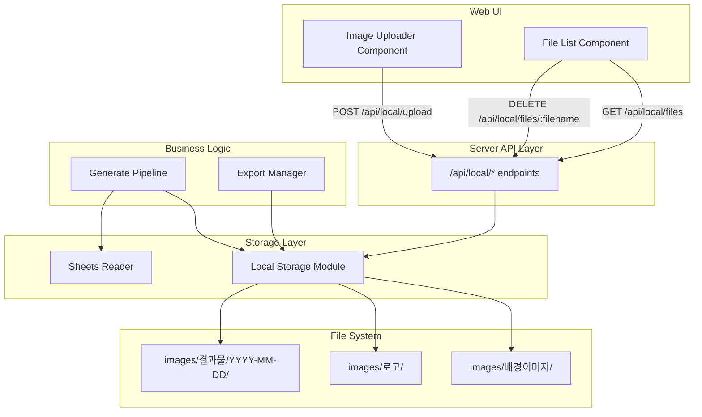

# Design Document: Local File Storage

## Overview

이 설계는 구글 드라이브 의존성을 제거하고 이미지 저장소를 로컬 파일 시스템으로 전환하는 기능을 정의합니다. 구글 시트 연동은 유지하되, 배경이미지/로고/결과물의 저장 및 조회를 서버 로컬 폴더에서 처리하여 다음 문제를 해결합니다:

- **스토리지 제약 해결**: 구글 드라이브 용량 제한 없이 무제한 저장
- **API Rate Limit 회피**: 구글 드라이브 API 호출 제거로 속도 제한 문제 해결
- **네트워크 지연 감소**: 로컬 파일 시스템 접근으로 빠른 I/O
- **설정 간소화**: 구글 드라이브 폴더 ID 및 권한 설정 불필요

기존 `DriveReader` 모듈을 `LocalStorage` 모듈로 대체하며, 파이프라인과 API 엔드포인트를 수정하여 로컬 파일 시스템과 통합합니다.

## Key Design Decisions

### 1. 파일명 자동 정규화
**결정**: 업로드 시 파일명을 자동으로 정규화 (공백 → 언더스코어, 특수문자 제거)
**이유**: 파일 시스템 호환성 보장, 크로스 플랫폼 지원, 한글 파일명 유지

### 2. 30일 자동 삭제
**결정**: 서버 시작 시 30일 이상 된 결과물 자동 삭제
**이유**: 디스크 공간 관리, 수동 정리 부담 감소

### 3. Figma 전용 다운로드
**결정**: 웹 UI 다운로드 기능 제거, Figma 파일에서만 결과물 확인
**이유**: 중복 기능 제거, 시스템 단순화, Figma가 이미 다운로드 기능 제공

### 4. 함수 기반 모듈
**결정**: LocalStorage를 클래스가 아닌 함수 기반으로 구현
**이유**: 상태 불필요, 의존성 주입 불필요, 테스트 간소화

## Architecture

### High-Level Architecture



### Module Replacement Strategy

기존 `DriveReader` 의존성을 `LocalStorage`로 교체:

| Component | Before | After |
|-----------|--------|-------|
| Pipeline | `DriveReader.downloadBackground()` | `readBackground()` |
| Pipeline | `DriveReader.downloadLogo()` | `readLogo()` |
| ExportManager | `DriveReader.uploadResultWithDate()` | `saveResult()` |
| ExportManager | `DriveReader.listResultFiles()` | `listResultFilenames()` |
| API Routes | `/api/drive/*` | `/api/local/*` |

## Components and Interfaces

### 1. LocalStorage Module

로컬 파일 시스템에 이미지를 저장/조회하는 핵심 모듈입니다.

**파일 경로**: `packages/server/src/local/local-storage.ts`

**주요 함수**:

```typescript
/**
 * 서버 시작 시 필요한 폴더 구조를 생성한다.
 * Requirements: 1.1, 1.2, 1.3
 */
export async function ensureFolders(): Promise<void>

/**
 * 파일명을 정규화한다 (공백 → 언더스코어, 특수문자 제거, 한글 유지).
 * Requirements: 16.1, 16.2, 16.3, 16.4
 */
export function normalizeFilename(filename: string): string

/**
 * 30일 이상 된 결과물 파일을 삭제한다.
 * Requirements: 6.6
 * @returns 삭제된 파일 수
 */
export async function cleanupOldResults(daysToKeep: number = 30): Promise<number>

/**
 * 배경이미지 폴더에서 파일을 읽는다.
 * Requirements: 4.1, 4.2, 4.3, 4.4
 */
export async function readBackground(filename: string): Promise<Buffer>

/**
 * 로고 폴더에서 파일을 읽는다.
 * Requirements: 5.1, 5.2, 5.3, 5.4
 */
export async function readLogo(filename: string): Promise<Buffer>

/**
 * 지정된 서브폴더에 파일을 저장한다 (파일명 자동 정규화).
 * Requirements: 2.2, 2.3, 2.5, 3.2, 3.3, 3.5
 * @returns 정규화된 파일명
 */
export async function saveFile(
  folderName: string,
  filename: string,
  data: Buffer
): Promise<string>

/**
 * 결과물을 날짜별 폴더에 저장한다.
 * Requirements: 6.1, 6.2, 6.3, 6.4, 6.5
 */
export async function saveResult(
  filename: string,
  data: Buffer,
  dateStr: string
): Promise<string>

/**
 * 지정된 폴더의 파일 목록을 반환한다.
 * Requirements: 8.1, 8.2, 8.3, 8.5
 */
export async function listFiles(folderName: string): Promise<LocalFile[]>

/**
 * 결과물 폴더의 모든 파일명을 반환한다 (중복 방지용).
 * Requirements: 10.1
 */
export async function listResultFilenames(): Promise<string[]>

/**
 * 파일을 삭제한다.
 * Requirements: 9.1, 9.2, 9.3
 */
export async function deleteLocalFile(
  folderName: string,
  filename: string
): Promise<void>
```

**인터페이스**:

```typescript
export interface LocalFile {
  id: string;      // 파일명을 ID로 사용
  name: string;    // 파일명
  folder: string;  // 폴더명 (배경이미지/로고)
  size: number;    // 파일 크기 (bytes)
}
```

**폴더 구조**:

```
images/                    (BASE_DIR = process.cwd() + '/images')
├── 배경이미지/
│   ├── 영화제목1.jpg
│   └── 영화제목2.jpg
├── 로고/
│   ├── LI_영화제목1.png
│   └── LI_영화제목2.png
└── 결과물/
    ├── 2024-01-15/
    │   ├── 영화제목1.jpg
    │   └── 영화제목1_2.jpg
    └── 2024-01-16/
        └── 영화제목2.jpg
```

**파일명 정규화 규칙**:

```typescript
// 예시:
normalizeFilename("영화 제목!@#.jpg")  // → "영화_제목.jpg"
normalizeFilename("Movie Title (2024).png")  // → "Movie_Title_2024.png"
normalizeFilename("LI_영화제목.png")  // → "LI_영화제목.png" (한글 유지)
```

**에러 처리**:

- 파일이 존재하지 않을 때: `Error("파일 '{filename}'을(를) '{folderName}' 폴더에서 찾을 수 없습니다")`
- 권한 오류 시: Node.js 기본 에러 메시지에 경로 포함
- 모든 에러는 상위 레이어에서 `FILE_NOT_FOUND` 타입으로 분류됨

### 2. Local API Routes

로컬 파일 시스템 작업을 위한 새로운 API 엔드포인트입니다.

**파일 경로**: `packages/server/src/routes/local-upload.ts` (신규 생성)

**엔드포인트**:

#### POST `/api/local/upload`

배경이미지 또는 로고를 업로드합니다.

**요청**:
- Content-Type: `multipart/form-data`
- Body:
  - `file`: 업로드할 파일 (binary)
  - `folder`: `"background"` 또는 `"logo"`

**응답**:
```typescript
{
  success: true,
  filename: string,  // 정규화된 파일명
  folder: string     // "배경이미지" 또는 "로고"
}
```

**Requirements**: 2.1, 2.2, 2.3, 2.5, 2.6, 3.1, 3.2, 3.3, 3.5, 3.6, 12.1, 12.2, 12.5

#### GET `/api/local/files`

배경이미지와 로고 폴더의 파일 목록을 조회합니다.

**응답**:
```typescript
{
  success: true,
  files: Array<{
    id: string,
    name: string,
    folder: string,
    size: number
  }>
}
```

**Requirements**: 8.1, 8.2, 8.3, 8.4, 8.5, 12.3, 12.6

#### DELETE `/api/local/files/:filename`

파일을 삭제합니다.

**요청**:
- Query Parameter: `folder` (`"배경이미지"` 또는 `"로고"`)

**응답**:
```typescript
{
  success: true
}
```

**Requirements**: 9.1, 9.2, 9.3, 9.4, 12.4

### 3. Pipeline Integration

`GeneratePipeline` 클래스를 수정하여 `LocalStorage`를 사용합니다.

**파일 경로**: `packages/server/src/pipeline/generate-pipeline.ts`

**변경 사항**:

```typescript
// Before
export interface PipelineDeps {
  sheetsReader: SpreadsheetReader;
  driveReader: DriveReader;  // 제거
  orchestrator: FigmaOrchestrator;
  exportManager: ExportManager;
}

// After
export interface PipelineDeps {
  sheetsReader: SpreadsheetReader;
  orchestrator: FigmaOrchestrator;
  exportManager: ExportManager;
  // LocalStorage는 함수 기반이므로 의존성 주입 불필요
}
```

**processRow 메서드 수정**:

```typescript
// Before
bgImage = await this.withRetry(() => 
  this.deps.driveReader.downloadBackground(bgFilename)
);

// After
import { readBackground, readLogo } from '../local/local-storage.js';

bgImage = await this.withRetry(() => 
  readBackground(bgFilename)
);
```

**Requirements**: 11.1, 11.2, 11.4

### 4. ExportManager Integration

`ExportManager` 클래스를 수정하여 `LocalStorage`를 사용합니다.

**파일 경로**: `packages/server/src/export/export-manager.ts`

**변경 사항**:

```typescript
// Before
constructor(
  private orchestrator: FigmaOrchestrator,
  private driveReader: DriveReader  // 제거
) {}

// After
constructor(
  private orchestrator: FigmaOrchestrator
) {}
```

**exportWithQualityAdjustment 메서드 수정**:

```typescript
// Before
const fileId = await this.driveReader.uploadResultWithDate(
  filename, jpgBuffer, today
);

// After
import { saveResult, listResultFilenames } from '../local/local-storage.js';

// 기존 파일 목록 조회 (중복 방지)
const existingFiles = await listResultFilenames();

// 파일명 생성 (중복 처리)
const filename = generateFilename(movieTitle, existingFiles);

// 로컬 저장
const fileId = await saveResult(filename, jpgBuffer, today);
```

**Requirements**: 11.3

### 5. Configuration Changes

`AppConfig` 인터페이스에서 구글 드라이브 관련 필드를 제거합니다.

**파일 경로**: `packages/shared/src/types.ts`

**변경 사항**:

```typescript
// Before
export interface AppConfig {
  google: {
    serviceAccountKey: object;
    spreadsheetId: string;
    driveFolderId: string;  // 제거
  };
  // ...
}

// After
export interface AppConfig {
  google: {
    serviceAccountKey: object;
    spreadsheetId: string;
  };
  // ...
}
```

**Requirements**: 13.1, 13.2, 13.3

### 6. Server Initialization

서버 시작 시 폴더 초기화 및 오래된 파일 정리를 수행합니다.

**파일 경로**: `packages/server/src/index.ts`

**추가 코드**:

```typescript
import { ensureFolders, cleanupOldResults } from './local/local-storage.js';

// 서버 시작 시
async function startServer() {
  // 폴더 생성
  await ensureFolders();
  console.log('[Server] 로컬 폴더 초기화 완료');
  
  // 30일 이상 된 결과물 삭제
  const deletedCount = await cleanupOldResults(30);
  console.log(`[Server] 오래된 결과물 ${deletedCount}개 삭제 완료`);
  
  // ... 기존 서버 시작 코드
}
```

**Requirements**: 1.1, 1.2, 1.3, 6.6

## Data Models

### LocalFile

로컬 파일 정보를 나타냅니다.

```typescript
export interface LocalFile {
  id: string;      // 파일명 (고유 식별자로 사용)
  name: string;    // 파일명
  folder: string;  // 폴더명 ("배경이미지" 또는 "로고")
  size: number;    // 파일 크기 (bytes)
}
```

### File System Structure

```
images/                           # BASE_DIR
├── 배경이미지/                   # Background images
│   ├── {title}.jpg
│   └── {title}.png
├── 로고/                         # Logo images
│   └── LI_{title}.png
└── 결과물/                       # Generated results
    ├── 2024-01-15/               # Date-based subdirectories
    │   ├── {title}.jpg
    │   └── {title}_2.jpg         # Duplicate handling
    └── 2024-01-16/
        └── {title}.jpg
```

## Error Handling

### Error Types

로컬 파일 시스템 작업에서 발생할 수 있는 에러:

1. **파일 없음 (FILE_NOT_FOUND)**
   - 발생 시점: `readBackground()`, `readLogo()` 호출 시
   - 메시지 형식: `"파일 '{filename}'을(를) '{folderName}' 폴더에서 찾을 수 없습니다"`
   - HTTP 상태: 500 (파이프라인)

2. **권한 오류 (PERMISSION_DENIED)**
   - 발생 시점: 폴더 생성, 파일 읽기/쓰기 시
   - 메시지 형식: Node.js 기본 에러 + 경로 정보
   - HTTP 상태: 500

3. **디스크 공간 부족 (DISK_FULL)**
   - 발생 시점: 파일 저장 시
   - 메시지 형식: Node.js 기본 에러
   - HTTP 상태: 500

### Error Handling Strategy

**LocalStorage 모듈**:
- 파일이 없을 때: `Error` throw (메시지에 파일명과 폴더명 포함)
- 파일 시스템 에러: Node.js 기본 에러를 그대로 전파
- 권한 에러: 에러 메시지에 경로 포함

**Pipeline**:
- `LocalStorage` 에러를 catch하여 `PipelineError`로 변환
- `FILE_NOT_FOUND` 타입으로 분류하여 히스토리에 기록
- 기존 `DriveReader` 에러 처리 로직과 동일하게 동작

**API Routes**:
- 에러 발생 시 `{ success: false, error: message }` 형식으로 응답
- 기타 에러: 500 상태 코드
- 모든 에러를 콘솔에 로깅

**Requirements**: 14.1, 14.2, 14.3, 14.4, 15.1, 15.2, 15.3, 15.4

## Testing Strategy

이 기능은 파일 시스템 I/O 작업이 주를 이루므로, **예제 기반 단위 테스트**와 **통합 테스트**를 사용합니다.

### Unit Tests

각 `LocalStorage` 함수에 대한 단위 테스트:

1. **폴더 생성 테스트**
   - `ensureFolders()` 호출 후 폴더 존재 확인
   - 이미 존재하는 폴더에 대한 멱등성 확인

2. **파일명 정규화 테스트**
   - 공백 → 언더스코어 변환 확인
   - 특수문자 제거 확인
   - 한글 문자 유지 확인
   - 파일 확장자 유지 확인

3. **파일 저장 테스트**
   - `saveFile()` 호출 후 파일 존재 및 내용 확인
   - 정규화된 파일명 반환 확인
   - 동일 파일명 덮어쓰기 확인

4. **파일 읽기 테스트**
   - `readBackground()`, `readLogo()` 정상 동작 확인
   - 존재하지 않는 파일 읽기 시 에러 확인
   - 에러 메시지 형식 확인

5. **결과물 저장 테스트**
   - `saveResult()` 호출 후 날짜 폴더 생성 확인
   - 동일 날짜에 여러 파일 저장 확인

6. **오래된 파일 삭제 테스트**
   - `cleanupOldResults()` 호출 후 30일 이상 파일 삭제 확인
   - 최근 파일은 유지 확인
   - 삭제된 파일 수 반환 확인

7. **파일 목록 조회 테스트**
   - `listFiles()` 반환 형식 확인
   - 빈 폴더 처리 확인
   - 파일 크기 정보 확인

8. **파일 삭제 테스트**
   - `deleteLocalFile()` 정상 동작 확인
   - 존재하지 않는 파일 삭제 시 에러 없음 확인

### Integration Tests

실제 파이프라인 및 API 엔드포인트와의 통합 테스트:

1. **파이프라인 통합 테스트**
   - 로컬 이미지를 사용한 카드뉴스 생성 전체 플로우
   - 파일 없음 에러 처리 확인
   - 결과물 저장 및 파일명 중복 처리 확인

2. **API 엔드포인트 테스트**
   - POST `/api/local/upload` 업로드 성공/실패 시나리오
   - GET `/api/local/files` 파일 목록 조회
   - DELETE `/api/local/files/:filename` 파일 삭제

3. **에러 처리 통합 테스트**
   - 권한 오류 시나리오 (읽기 전용 폴더)
   - 파일 시스템 에러 전파 확인

### Test Environment Setup

- **임시 폴더 사용**: 각 테스트는 독립된 임시 폴더에서 실행
- **테스트 후 정리**: `afterEach`에서 임시 폴더 삭제
- **모의 데이터**: 작은 크기의 샘플 이미지 사용 (1KB 이하)

### Test Coverage Goals

- LocalStorage 모듈: 90% 이상
- API Routes: 80% 이상
- Pipeline 통합: 주요 시나리오 커버

## Implementation Notes

### Migration Path

기존 구글 드라이브 기반 시스템에서 로컬 파일 시스템으로 마이그레이션하는 단계:

1. **Phase 1: LocalStorage 모듈 완성**
   - 파일명 정규화 함수 추가
   - 30일 자동 삭제 함수 추가
   - 단위 테스트 작성

2. **Phase 2: API Routes 구현**
   - `local-upload.ts` 라우터 생성
   - 기존 `/api/drive/*` 엔드포인트와 병행 운영

3. **Phase 3: Pipeline 통합**
   - `GeneratePipeline` 수정
   - `ExportManager` 수정
   - 통합 테스트 실행

4. **Phase 4: 구글 드라이브 코드 제거**
   - `DriveReader` 의존성 제거
   - `/api/drive/*` 엔드포인트 제거
   - `AppConfig`에서 `driveFolderId` 제거 (완료)

5. **Phase 5: 문서 및 설정 업데이트**
   - README 업데이트
   - 설정 마법사 수정 (드라이브 폴더 ID 입력 제거)

### Performance Considerations

- **로컬 I/O 속도**: 구글 드라이브 API 대비 10-100배 빠름
- **디스크 공간**: 30일 자동 삭제로 관리
- **동시성**: Node.js 비동기 I/O로 여러 파일 동시 처리 가능
- **캐싱**: 파일 시스템 자체가 OS 레벨 캐싱 제공

### Security Considerations

- **경로 탐색 공격 방지**: 파일명에 `..` 포함 시 거부
- **파일 형식 검증**: 확장자 및 MIME 타입 확인
- **파일 크기 제한**: multer 설정으로 20MB 제한
- **권한 설정**: `images/` 폴더는 서버 프로세스만 접근 가능

### Backup Strategy

로컬 파일 시스템 사용 시 백업 전략:

- **자동 백업**: 서버 레벨 백업 솔루션 사용 (rsync, 클라우드 백업 등)
- **버전 관리**: 날짜별 폴더로 결과물 자동 분류
- **복구 절차**: 백업에서 `images/` 폴더 복원

## Future Enhancements

1. **이미지 썸네일 생성**: 파일 목록 조회 시 썸네일 제공
2. **파일 검색 기능**: 파일명 기반 검색 API
3. **스토리지 사용량 모니터링**: 디스크 공간 사용량 대시보드
4. **자동 백업 스크립트**: 주기적으로 클라우드에 백업
5. **이미지 최적화**: 업로드 시 자동 압축 및 포맷 변환
6. **파일 버전 관리**: 동일 파일명 업로드 시 버전 히스토리 유지
